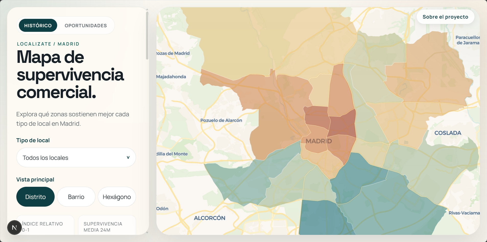

# Localízate

Localízate es una web de inteligencia comercial para Madrid construida sobre datos abiertos, analítica geoespacial y modelos de supervivencia. Su objetivo es ayudar a explorar el tejido comercial de la ciudad y a evaluar ubicaciones concretas con una lectura visual, explicable y útil para la toma de decisiones.

Web pública: https://localizate.pages.dev/



## Qué ofrece

- Vista `Histórico`: lectura territorial del mercado por distrito, barrio y hexágono.
- Vista `Oportunidades`: evaluación puntual de locales disponibles o direcciones concretas.
- Contexto urbano y socioeconómico: renta, población, accesibilidad, equipamientos, avisos e indicadores territoriales.
- Arquitectura de publicación ligera: frontend estático, datos públicos precalculados y servicios dinámicos solo donde aportan valor.

## Arquitectura

- `front/`: aplicación web en `Next.js`, `TypeScript`, `MapLibre` y `deck.gl`.
- `back/`: pipeline analítico en Python para construir artefactos, features y exportaciones públicas.
- `workers/opportunity-geocode/`: worker para geocodificación y resolución de dirección a sección censal.
- `.github/workflows/`: automatizaciones de build, publicación de datos y despliegue.
- `docs/`: documentación funcional, técnica y metodológica preparada para una lectura pública.

La publicación actual sigue un patrón simple:

- `Cloudflare Pages` sirve la web estática.
- `Cloudflare R2` aloja los JSON públicos pesados publicados desde el pipeline de despliegue.
- `Cloudflare Workers` resuelve la geocodificación bajo demanda.
- `GitHub Actions` orquesta build, publicación y despliegue.

## Arranque local

Backend:

```powershell
.venv\Scripts\python.exe -m pip install -r back\requirements.txt
cd back
$env:PYTHONPATH = "src"
..\.venv\Scripts\python.exe -m unittest
```

Frontend:

```powershell
cd front
npm install
npm run typecheck
npm run dev
```

Build estático:

```powershell
cd front
npm run build:static
```

Builders más habituales desde la raíz:

```powershell
$env:PYTHONPATH = "back/src"
.venv\Scripts\python.exe back\scripts\build_frontend_map_artifacts.py
.venv\Scripts\python.exe back\scripts\build_frontend_opportunity_artifacts.py
.venv\Scripts\python.exe back\scripts\build_frontend_opportunity_listings.py
```

## Estructura del repo

```text
Localízate/
|- front/                  # web pública
|- back/                   # pipeline, scripts y tests
|- workers/                # servicios dinámicos
|- docs/                   # documentación pública del proyecto
|- storage/                # datos locales no versionados
`- .github/workflows/      # automatización de despliegues y refrescos
```

## Qué no verás al clonar (según `.gitignore`)

Para evitar confusiones: una parte de los artefactos de trabajo y de build no se versiona en Git.

- Entornos y dependencias locales: `.venv/`, `node_modules/`, `.next/`.
- Datos operativos locales: `storage/raw/`, `storage/data/`, `storage/models/`.
- Artefactos pesados de datos y modelos (`.parquet`, `.feather`, `.joblib`, `.pkl`, `.sqlite`, `.duckdb`, `.gpkg`, etc.).
- Parte de los artefactos históricos de mapa en `front/public/data/map/historical/hex-composition/`.

Excepción importante: sí se versiona `front/public/data/opportunities/sections/geometry.geojson` porque es necesario para la visualización pública base.

## Documentación recomendada

- [Resumen del proyecto](docs/project/project-overview.md)
- [Visión de producto](docs/product/product-overview.md)
- [Inventario documental](docs/README.md)
- [Fuentes y contratos de datos](docs/data/raw_data_inventory.md)
- [Panel socioeconómico por sección](docs/data/section_socioeconomic_panel.md)
- [Resultados y decisiones de modelado](docs/modeling/survival_canonical.md)
- [Glosario de categorías comerciales](docs/reference/ACTIVITY_GLOSSARY.md)

## Alcance y límites

El repositorio publica código, documentación y artefactos necesarios para entender el proyecto, pero no incluye el lago de datos bruto, modelos locales intermedios ni credenciales de despliegue. La web no pretende sustituir trabajo de campo, análisis financiero ni validación comercial in situ: es una herramienta de apoyo a la decisión, no una garantía de éxito.
